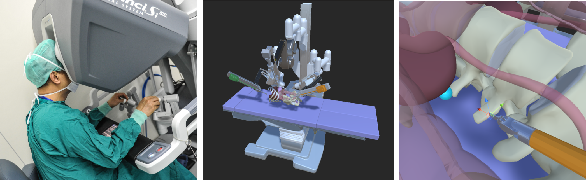
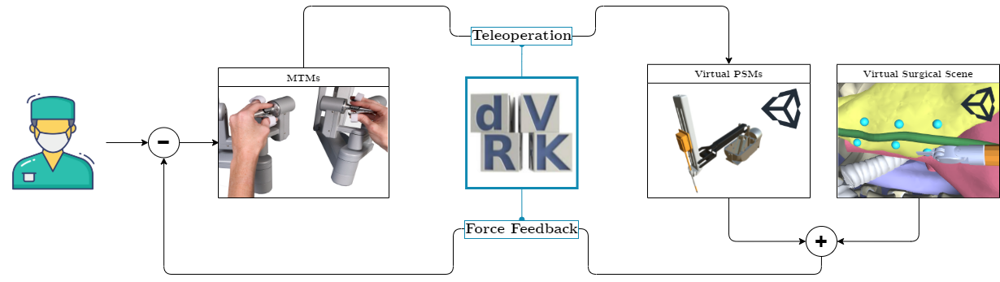
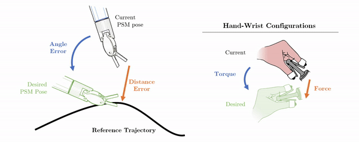

 
<a>
<picture>
  <source media="(prefers-color-scheme: dark)" srcset="Notes/readme/banner_light.png">
   
</picture>
</a> 

***
# S.T.E.V.E.
## *Surgical Training Enhanced Virtual Environment*
A surgical training simulator integrated with the *daVinci* surgical system, developed at the Medical Robotics section of [NearLab](https://nearlab.polimi.it/), in the [Department of Electronics, Information and Bioengineering](https://www.deib.polimi.it/ita/home) at _Politecnico di Milano_.

#### Project Maintainer: *Alberto Rota*
#### Project Supervisor: *Prof. Elena De Momi, PhD*
***
If you are looking for installation and usage instructions, go to 
<a href="https://github.com/NEARLab-MedicalRobotics/dVRK/wiki">this repo's Wiki</a>:   

 
<a href="https://github.com/NEARLab-MedicalRobotics/dVRK/wiki">
<picture>
  <source media="(prefers-color-scheme: dark)" srcset="Notes/readme/guide_button_white.png">
   
</picture>
</a> 

***
*STEVE* is a simulated training environment for learning surgical robotic skills. It allows aspining robotic surgeons to develop key surgical skills in a safe and controlled environment, without the need for surgical phantoms or animal models. 

*STEVE* communicates with the *daVinci* surgical system via the [dVRK](https://github.com/jhu-dvrk/sawIntuitiveResearchKit) package: a Unity application receives the motion commands from the MTMs of the teleoperation console and moves the joints of the virtual PSMs accordingly. Simulated surgical scenes and training scenarios feature several objects and tools, with which the surgeon can interact with.

### An Enhanced Training Experience
Training surgical skills is a complex and time-consuming process. *STEVE* implements visuo-haptic assistance algorithms that provide guidance to the trainee during the execution of a task. 
* **Visual Guidance** consists in the color-coding of the virtual instruments and object, which change hue depending on the correctness of the exectution
* **Haptic Guidance** consists in providing a mechanical feedback force to the surgeon's hands and wrists, redirecting its motion towards targets or away from obstacles

#### The haptic feedback rationale
The trainee sits at the teleoperation console of a *daVinci* surgical robot and manipulates the MTMs

His motion will be replicated inside of the virtual surgical environment on virtual PSMs

In the virtual surgical scene, the relative position of the surgical tool and the anatomical structures will be used to compute the haptic feedback force

The force computed in the Unity environment is then, frame by frame, applied to the MTMs that the operator is holding as an **haptic force feedback**: transformations and changes in RFs are required. As a consequence, the user at the teleoperation console will feel an impediment or a guidance when performing the surgical tasks, allowing him/her to get optimally re-directed towards the desired pre-planned trajectory/workspace.

The image below is a very synthetic block diagram of the negative feedback for the haptic force

<!--  -->

# The Surgical Tasks
8 Tasks are implemented by default on the simulator: 4 are surgical training tasks, while the others try to emulate a real surgical scenario.

This panel shows a preview of them.

These have been built with the purpose of requiring the trainee to sollecitate 4 main surgical abilities, in specifics:
* **Wrist dexterity:** The ability of achieving a wide range of complex orientations of the wrist
* **Steady hand:** The adherence and stabilization around trajectories/paths
* **Visual abstraction:** The capability of operating in areas where the surgical tool is not completely visible
* **Hand-to-hand cooperation:** The capacity of resolving tasks with both manipulators and the prowess is handing objects from one manipulator to another

# Future Work
*STEVE* is an ongoing project, constantly enriched by optimizations and by new features. Possible work topics include:

#### Generic Improvements
* **New tasks:** the simulator can be easily extended with new tasks, by adding new scenes and new training scenarios
* **Improved GUI:** *STEVE* does not yet feature an appealing GUI, which will improve the navigation and the user experience
* **Task Adaptivity:** Task difficulty should change according to the trainee's performace. The better the execution the harder should the task be, requiring more articulate wrist movements, better camera control, *etc*
* **Progess Monitoring:** Provide a quantitative measure of the trainee's performance and save it in a database, so that the surgeon's progress can be monitored on a milti-day basis

#### Control Strategies
* **Camera Control:** the camera is currently fixed in an optimal position for each training task. However, as a real teleoperated system allows to move the camera through the pedalboard, it would be interesting to implement this feature in the simulator as well
* **Haptic Feedback:** Collisions detected by the simulated environment may be used to provide haptic feedback to the practitioner. This would allow to provide a more realistic experience, as the surgeon would feel the mechanical resistance of the virtual objects. The effect of the haptic feedback on the surgical performance should be evaluated with an experimental study
* ****

#### Artificial Intelligence
* **Task Automatization:** Some surgical tasks (suturing, knotting, *etc*) can be automatized and executed optimally without the surgeon teleoperating the robot. A Reinforcement Learning algorithm could be used to train a policy that would allow the robot to autonomously perform such tasks
* **Adaptive Training:** With machine leaning, the task difficulty and the target skills could be determined from the trainee's performance on a data-driven basis.