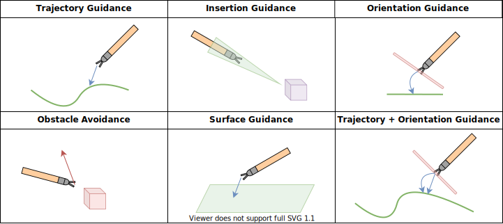
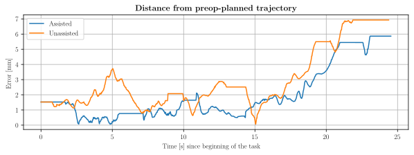
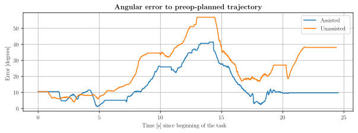

***
# S.T.E.V.E.
## *Surgical Training Enhanced Virtual Environment*
A surgical training simulator integrated with the *daVinci* surgical system, developed at the Medical Robotics section of [NearLab](https://nearlab.polimi.it/), in the [Department of Electronics, Information and Bioengineering](https://www.deib.polimi.it/ita/home) at _Politecnico di Milano_.

#### Project Maintainer: *Alberto Rota*
#### Project Supervisor: *Prof. Elena De Momi, PhD*
***

*STEVE* is a simulated training environment for learning surgical robotic skills. It allows aspining robotic surgeons to develop key surgical skills in a safe and controlled environment, without the need for surgical phantoms or animal models. 

*STEVE* communicates with the *daVinci* surgical system via the [dVRK](https://github.com/jhu-dvrk/sawIntuitiveResearchKit) package: a Unity application receives the motion commands from the MTMs of the teleoperation console and moves the joints of the virtual PSMs accordingly. Simulated surgical scenes and training scenarios feature several objects and tools, with which the surgeon can interact with.

### An Enhanced Training Experience
Training surgical skills is a complex and time-consuming process. *STEVE* implements visuo-haptic assistance algorithms that provide guidance to the trainee during the execution of a task. 
* **Visual Guidance** consists in the color-coding of the virtual instruments and object, which change hue depending on the correctness of the exectution
* **Haptic Guidance** consists in providing a mechanical feedback force to the surgeon's hands and wrists, redirecting its motion towards targets or away from obstacles

The trainee sits at the teleoperation console of a *daVinci* surgical robot and manipulates the MTMs

His motion will be replicated inside of the virtual surgical environment on virtual PSMs

In the virtual surgical scene, the relative position of the surgical tool and the anatomical structures will be used to compute the haptic feedback force

The force computed in the Unity environment is then, frame by frame, applied to the MTMs that the operator is holding as an **haptic force feedback**: transformations and changes in RFs are required. As a consequence, the user at the teleoperation console will feel an impediment or a guidance when performing the surgical tasks, allowing him/her to get optimally re-directed towards the desired pre-planned trajectory/workspace.

The image below is a very synthetic block diagram of the negative feedback for the haptic force

# The Surgical Tasks
8 Tasks are implemented by default on the simulator: 4 are surgical training tasks, while the others try to emulate a real surgical scenario.

This panel shows a preview of them.

These have been built with the purpose of requiring the trainee to sollecitate 4 main surgical abilities, in specifics:
* **Wrist dexterity:** The ability of achieving a wide range of complex orientations of the wrist
* **Steady hand:** The adherence and stabilization around trajectories/paths
* **Visual abstraction:** The capability of operating in areas where the surgical tool is not completely visible
* **Hand-to-hand cooperation:** The capacity of resolving tasks with both manipulators and the prowess is handing objects from one manipulator to another

# The Virtual Fixtures
An in-depth analysis of the scientific literature combined with further development in the view of optimizing this specific case of surgical training yielded the implementation of 6 types of Virtual Fixtures apt to grant guidance for all surgical abilities (as above *wrist dexterity*, *steady hand*, *visual abstraction* and *hand-to-hand cooperation*) and that can be deployed in each of the surgical task of the simulator. 

They have been formulated as follows:

* **Trajectory Guidance:** The feedback force will act in order to pull the tooltip towards a trajectory planned in the pre-op stage
* **Insetion Guidance:** The feedback force will keep the tooltip inside a "cone of approach" that is directed towards a target. This cone is set up in pre-op
* **Orientation Guidance**: A feedback torque will act in order to align the surgical tooltip in a specific orientation set up in pre-op
* **Obstacle Avoidance**: The feedback force will act in order to keep the surgical tool away from undesired areas
* **Surface Guidance:** Feedback force and torque are applied to keep the surgical instrument close to a surface (planar or non-planar) and with the same orientation as the surface itself
* **Trajectory and Orientation Guidance**: A combination of *Trajectory Guidance* and *Orientation Guidance*

# Preliminary Results
A sample video of a volunteer user with little experience in surgical training **WITHOUT ASSISTANCE**

***
The same subject performing the same task **WITH HAPTIC VIRTUAL FIXTURES APPLIED**

Following are the plots of the distance and angular errors (in *mm* and *degrees*, respectively) that the trainee issued while performing this suturing task. Position and orientation data are recorded in real time (30 frames per second) by the simulator and are saved as a `.csv` file ready for and extensive data analysis. 

**Even though this is preliminary data and no direct or indirect conclusion can be gathered**, it is still qualitatively evident how in general both the distance and angular error in the task performed with assistance (blue line) are lower than in the unassisted case (orange line)
